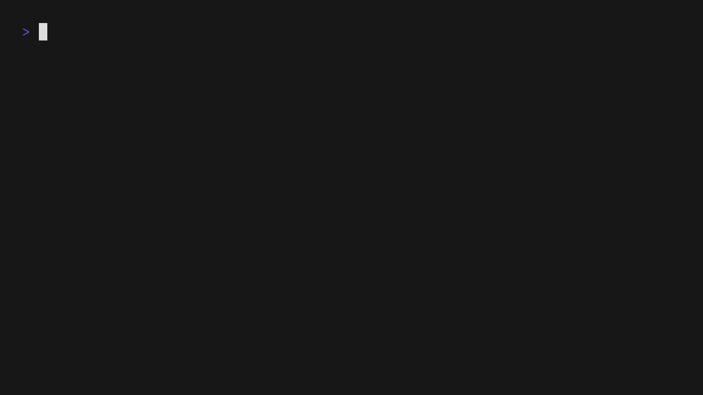

# ColdCase: Integrated Digital Forensics Tool

[](https://golang.org/)
[](https://choosealicense.com/licenses/mit/)
[](https://github.com/Fakechippies/ColdCase)
[](https://www.docker.com/)
[](#features)

A comprehensive CLI tool that integrates 118+ digital forensics utilities into a single, unified interface. ColdCase implements a **Hybrid Execution Model**: it runs tools natively if available, but transparently falls back to a Docker/Podman container if not, with automatic path mapping.

## Showcase



## 🚀 Key Features

- **Hybrid Proxy Runtime**: Native speed when possible, container reliability when needed.
- **Smart Path Mapping**: Host paths in arguments are automatically detected and mounted to the container.
- **Extended Toolset**: 118+ tools across 14 categories.
- **Plaso Integration**: Structured `plaso` command group for timeline analysis.
- **Container Management**: Built-in commands to build, pull, and shell into the forensics environment.

## 🛠️ Tool Categories

### [DidierStevens Suite](https://blog.didierstevens.com/programs/pdf-tools/) (15 tools)
`1768`, `pdf-parser`, `pdfid`, `oledump`, `pecheck`, `base64dump`, `emldump`, `jpegdump`, `hash`, `cut-bytes`, `find-file-in-file`, `byte-stats`, `extractscripts`, `cs-parse-traffic`, `amsiscan`

### [Volatility3](https://github.com/volatilityfoundation/volatility3) Memory Forensics (31 plugins)
- **Windows**: `pslist`, `pstree`, `dlllist`, `handles`, `cmdline`, `envars`, `filescan`, `modules`, `driverscan`, `callbacks`, `services`, `registry`, `hashdump`, `malfind`, `mutantscan`, `ssdt`, `getsids`, `privs`, `vadinfo`, `dumpfiles`, `mftscan`
- **Linux**: `pslist`, `pstree`, `bash`, `proc_maps`, `mount_info`
- **macOS**: `pslist`, `pstree`, `mount_info`
- **Utility**: `vol`, `volshell`, `info`

### Network Forensics (11 tools)
`tshark`, `tcpdump`, `zeek`, `ngrep`, `tcpflow`, `pcapfix`, `tcpreplay`, `tcpstat`, `argus`, `p0f`, `networkminer`

### File Carving & Recovery (7 tools)
`foremost`, `scalpel`, `photorec`, `bulk-extractor`, `testdisk`, `ddrescue`, `safecopy`

### Timeline & Log Analysis (5 tools + Plaso)
- **Commands**: `hayabusa`, `evtx_dump`, `timeliner`, `chainsaw`
- **Plaso Group**: `plaso parse`, `plaso sort`, `plaso psteal`, `plaso parsers`

### Malware & Pattern Matching (5 tools)
`yara`, `floss`, `strings`, `capa`, `vt` (VirusTotal CLI)

### Windows Artifacts (7 tools)
`regripper`, `regrippy`, `analyzeMFT`, `ntfsls`, `ntfscat`, `indxparse`, `registry-dump`

### Steganography & Media (5 tools)
`steghide`, `zsteg`, `wavsteg`, `mediainfo`, `stegdetect`

### Hashing & Verification (4 tools)
`md5deep`, `hashdeep`, `ssdeep`, `tlsh`

### Mobile Forensics (4 tools)
`aleapp`, `ileapp`, `adb`, `ideviceinfo`

### System Utilities (6 tools)
`xxd`, `objdump`, `readelf`, `nm`, `file`, `ldd`

### Sleuth Kit (5 tools)
`fls`, `fsstat`, `istat`, `jls`, `tsk_loaddb`

## 📦 Installation

### Prerequisites
- [Go 1.25+](https://golang.org/)
- (Optional) Docker or Podman for the hybrid container runtime.

### Automatic Setup
```bash
# Clone the repository
git clone https://github.com/Fakechippies/ColdCase
cd ColdCase

# Build the CLI
go build -o bin/coldcase ./cmd/coldcase

# Option A: Install tools on the host
bin/coldcase install

# Option B: Set up the hybrid container (recommended)
bin/coldcase install --container
```

## 💻 Usage

### Basic Commands
```bash
bin/coldcase list             # Show all 118+ tools
bin/coldcase check            # Check tool status (native/container)
bin/coldcase container status  # Check Docker/Podman status
```

### Hybrid Engine Examples
If `tshark` is not on your host, ColdCase runs it via the container automatically:
```bash
# Path /evidence/dump.pcap is auto-detected and mounted to the container
bin/coldcase tshark -r /evidence/dump.pcap -Y "http"
```

### Plaso Timeline Analysis
```bash
bin/coldcase plaso parse disk.img      # log2timeline
bin/coldcase plaso sort storage.plaso  # psort
bin/coldcase plaso parsers --list      # list available parsers
```

### Container Management
```bash
bin/coldcase container build  # Build the forensics image locally
bin/coldcase container shell  # Open a bash shell inside the container
```

## 🛠️ Architecture

ColdCase uses a **Modular Proxy Pattern** written in Go:
- **`pkg/runner`**: The core execution engine. It checks for native binary existence, and if missing, executes the command via `docker run` or `podman run`.
- **Argument Remapping**: The runner scans arguments for host filesystem paths, generates bind-mount flags (`-v`), and remaps the argument paths to match the container environment.
- **`Dockerfile`**: A multi-stage build providing a pre-configured forensics environment with all 118+ utilities.

## License

[](https://choosealicense.com/licenses/mit/)

This project integrates various open-source forensics tools. Please check individual tool licenses for specific requirements.
